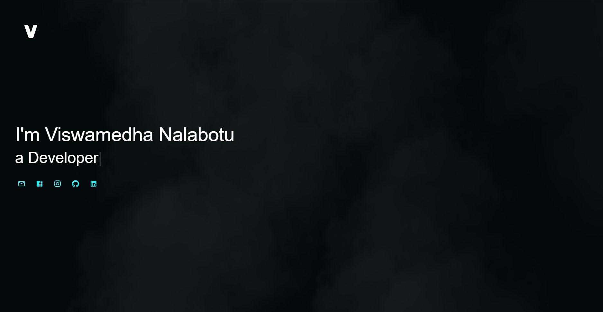

# viswamedha.com
[viswamedha.com](https://viswamedha.com) is my personal website, designed to showcase my services and portfolio. This release marks the `fourth` iteration of the site, featuring some new ideas (see below), a reworked CSS theme for a fresh look, and enhanced consistency across all pages. Subdomains were removed due to site authentication incompatibilities, but I hope to implement them again in the future. Additionally, several key optimizations have been implemented to improve performance and functionality.

## Built with
[](https://reactjs.org/)
[](https://vite.dev/)
[](https://mui.com/)
[](https://www.djangoproject.com/)
[](https://www.django-rest-framework.org/)
[](https://channels.readthedocs.io/)
[](https://www.postgresql.org/)
[](https://redis.io/)
[](https://www.docker.com/)
[](https://traefik.io/)
[](https://mailu.io/)

## Development
My website is currently live, but far from perfection. I do try to work on it when time allows as I use it for showcasing my skillset in the domain of web development and I have quite a few more ideas yet to implement for this iteration.



## Features
- [x] Blog & Posts
- [x] Calendar
- [x] Student Management
- [x] API
- [x] Programmable Redirects
- [ ] Subdomain Routing
- [ ] Database Query Optimization

## Run Locally
### Run Locally - Docker

Follow these steps to run a local instance of my website using Docker:

1. Clone this git repository somewhere with sufficient storage:
    ```sh
    git clone https://github.com/NV-9/viswamedha.com.git
    ```
2. Ensure Docker is installed and running, any recent version should do.
3. Using any terminal (Command Prompt, PowerShell, Terminal, etc.), navigate to the project folder:
    ```sh
    cd viswamedha.com
    ```
4. Create a .env file in the project directory populating it as follows:
    Note that certain functionality may break across the site since these variables are only sufficient for the Docker container, but the core features should work as expected.
    ```env
    DJANGO_DEBUG=True
    DJANGO_SECRET_KEY=<make-something-up-here>
    DJANGO_ALLOWED_HOSTS=.localhost,127.0.0.1
    POSTGRES_USER=postgres
    POSTGRES_DB=postgres
    POSTGRES_PASSWORD=postgres
    POSTGRES_HOST=postgres
    POSTGRES_PORT=5432
    REDIS_HOST=redis
    REDIS_PORT=6379
    VITE_API_URL=/api/
    DOMAIN_NAME=localhost
    ```
5. Run the container with the following command:
    ```sh
    docker compose -f docker-compose.dev.yml up -d
    ```
6. You will need to use this command to create a superuser account, to access the admin and restricted pages.
    ```python
    docker exec -it mysite python manage.py createsuperuser
    ```
7. Simply navigate to `localhost` in any modern browser to view the running website.

### Run Locally - Manual Setup  
Follow these steps to run a local instance of my website without Docker:  

1. **Clone the repository**  
    Clone this git repository somewhere with sufficient storage:  
    ```sh
    git clone https://github.com/NV-9/viswamedha.com.git
    ```

2. **Ensure prerequisites are installed**  
    - Python >= 3.10
    - Node.js and npm (latest version recommended)
    - PostgreSQL installed and running locally
    - Redis installed and running locally

3. **Using any terminal (Command Prompt, PowerShell, Terminal, etc.), navigate to the project folder:**  
    ```sh
    cd viswamedha.com
    ```
4. Set up a Python virtual environment
    Create a Python virtual environment named env and activate it:
    ```sh
    python -m venv env  # Create the virtual environment
    source env/bin/activate  # For macOS/Linux
    env\Scripts\activate     # For Windows
    ```
5. **Install backend dependencies**  
    Upgrade pip and install the required Python dependencies:
    ```sh
    pip install --upgrade pip  
    pip install -r requirements.txt  
    ```
6. **Install frontend dependencies**  
    Move to the frontend folder and install the necessary npm packages:
    ```sh
    cd frontend
    npm install
    cd ..
    ```
7. **Create and configure the .env file**  
    Create a .env file in the root project directory and populate it as follows:
    ```env
    DJANGO_DEBUG=True
    DJANGO_SECRET_KEY=<make-something-up-here>
    DJANGO_ALLOWED_HOSTS=.localhost,127.0.0.1
    POSTGRES_USER=postgres
    POSTGRES_DB=postgres
    POSTGRES_PASSWORD=postgres
    POSTGRES_HOST=localhost
    POSTGRES_PORT=5432
    REDIS_HOST=localhost
    REDIS_PORT=6379
    VITE_API_URL=/api/
    DOMAIN_NAME=localhost
    ```
    Ensure that POSTGRES_HOST and REDIS_HOST point to your local installations of PostgreSQL and Redis.
8. **Run database migrations**  
    Apply the migrations to set up the database schema:
    ```sh
    python manage.py migrate
    ```
9. **Create a superuser**  
    Create a superuser account to access the admin and restricted pages:
    ```sh
    python manage.py createsuperuser
    ```
10. **Run the development servers**  
    Open two terminal windows and:  
        In the first terminal, run the Django development server:  
    ```sh
    python manage.py runserver 
    ```  
    In the second terminal, run the frontend development server (Vite):  
    ```sh
    npm run dev
    ```

## License

This project is licensed under the terms of the MIT License.

### Usage Restrictions
- This project is intended for educational purposes only.
- You are not permitted to use the code or content for commercial purposes.
- You cannot redistribute or make copies of the project for commercial use or personal gain.

See the [LICENSE](./LICENSE) file for more details.